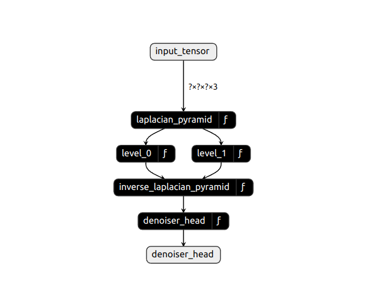
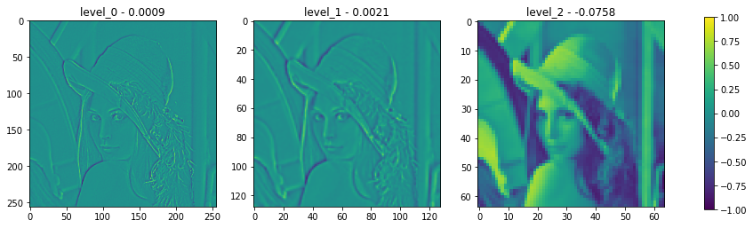

<div align="center">

**A library for blind image denoising algorithms using bias free denoising CNN's**
___

[Getting Started](#Pretrained) •
[License](https://github.com/NikolasMarkou/blind_image_denoising/blob/main/LICENSE)

[]()
[]()

</div>

___

# Blind Image Denoising

## Target
The target is to create a series of:

* interpretable
* multi scale
* high performance
* low memory footprint
 
models that performs denoising on an input (grayscale or colored) image. 

## Interpretation 
Interpretation comes naturally by implementing the CVPR 2020 paper : 

["ROBUST AND INTERPRETABLE BLIND IMAGE DENOISING VIA BIAS - FREE CONVOLUTIONAL NEURAL NETWORKS"](https://arxiv.org/abs/1906.05478)

This paper provides excellent results


Which can also be completely interpretable as a mask per pixel


## Multi-Scale
The system is trained in multiple scales by implementing ideas 
from LapSRN (Laplacian Pyramid Super-Resolution Network) and MS-LapSRN (Multi-Scale Laplacian Pyramid Super-Resolution Network)


## Low-Memory footprint
By using a gaussian pyramid and a shared bias-free CNN model between each scale, 
we can ensure that we have a small enough model to run on very small devices while ensure we
have a big enough ERF (effective receptive field) for the task at hand.

## Corruption types
In order to train such a model we corrupt an input image using 
several types of noise and then try to recover the original image

* normally distributed additive noise
* normally distributed multiplicative noise

## Image examples

* these images were gathered while training on patches of 128x128
* we can clearly see that the model adapts well to different ranges of noise

|Normal                   |  Noisy                  |  Denoised               |
|-------------------------|-------------------------|-------------------------|
 |  ||
 |  ||
 |  ||
 |  ||
 |  ||
 |  ||


## How to use (from scratch)

1. prepare training input
2. prepare training configuration
3. run training
4. export to tflite and saved_model format
5. use models

## How to use (pretrained)

Use any of the pretrained models included in the package
* resnet_5x5_bn_3x3
* sparse_resnet_5x5_bn_3x3
* sparse_resnet_4x5_bn_3x3

### Train
Prepare a training configuration and train with the following command:  
```
python -m bfcnn.train \ 
  --model-directory ${TRAINING_DIR} \ 
  --pipeline-config ${PIPELINE}
```
### Export
Export to frozen graph and/or tflite with the following command:
```
python -m bfcnn.export \
    --checkpoint-directory ${TRAINING_DIR} \
    --pipeline-config ${PIPELINE} \
    --output-directory ${OUTPUT_DIR} \
    --to-tflite
```

### Pretrained
Use a pretrained model or load a saved_model

```python
import bfcnn
import tensorflow as tf

# load model
denoiser_model = bfcnn.load_model("resnet_5x5_bn_3x3")

# create random tensor
input_tensor = \
    tf.random.uniform(
        shape=[1, 256, 256, 1],
        minval=0,
        maxval=255,
        dtype=tf.int32)
input_tensor = \
    tf.cast(
        input_tensor,
        dtype=tf.uint8)

# run inference
denoised_tensor = denoiser_model(input_tensor)
```

## Model types
We have used traditional (bias free) architectures.
* resnet
* resnet with sparse constraint
* resnet with on/off per resnet block gates 
* all the above models with multi-scale processing

### Additions
#### Multi-Scale Laplacian Pyramid
Our addition (not in the paper) is the laplacian multi-scale pyramid
that expands the effective receptive field without the need to add many more layers (keeping it cheap computationally).



#### Multi-Scale Gaussian Pyramid
Our addition (not in the paper) is the gaussian multi-scale pyramid
that expands the effective receptive field without the need to add many more layers (keeping it cheap computationally).

#### Normalization layer
Our addition (not in the paper) is a (non-channel wise and non-learnable) normalization layer (not BatchNorm) 
after the DepthWise operations. This is to enforce sparsity with the differentiable relu below.

#### Differentiable RELU
Our addition (not in the paper) is a differentiable relu for specific operations.


