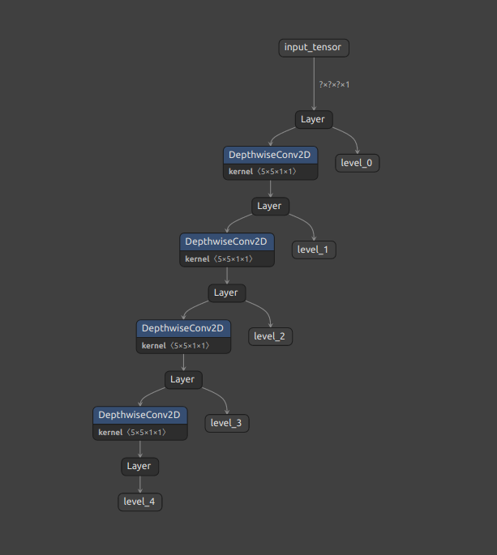

# Blind Image Denoising
Implementing CVPR 2020 paper : 

["ROBUST AND INTERPRETABLE BLIND IMAGE DENOISING VIA BIAS - FREE CONVOLUTIONAL NEURAL NETWORKS"](https://arxiv.org/abs/1906.05478)

This paper provides excellent results


Which can also be completely interpretable as a mask per pixel


## Target
The target is to create an explainable bias-free 
model that performs denoising on an input image.

## Corruption types
In order to train such a model we corrupt an input image using 
several types of noise and then try to recover the original image

* normally distributed additive noise
* normally distributed multiplicative noise
* subsampling

## Image examples

* these images were gathered while training on patches of 128x128
* we can clearly see that the model adapts well to different ranges of noise

|Normal                   |  Noisy                  |  Denoised               |
|-------------------------|-------------------------|-------------------------|
 |  ||
 |  ||
 |  ||
 |  ||
 |  ||
 |  ||


## Model types
We have used traditional (bias free) architectures.
* resnet
* resnet with sparse constraint
* resnet with on/off gates 
* all the above models with multi-scale processing

Our addition (not original in the paper) is the gaussian multi-scale that expands the effective receptive field without the need to add many more layers (keeping it cheap computationally)



The different levels of the pyramid connect like this 


## How to use (from scratch)

1. prepare training input
2. prepare training configuration
3. run training
4. export to tflite and saved_model format
5. use models

## How to use (pretrained)

1. use any of the pretrained models included in the package
    1. resnet_5x5_bn_3x3
    2. sparse_resnet_5x5_bn_3x3
    3. sparse_resnet_4x5_bn_3x3
  
### Train
Prepare a training configuration and train with the following command:  
```
python -m bfcnn.train \ 
  --model-directory ${TRAINING_DIR} \ 
  --pipeline-config ${PIPELINE}
```
### Export
Export to frozen graph and/or tflite with the following command:
```
python -m bfcnn.export \
    --checkpoint-directory ${TRAINING_DIR} \
    --pipeline-config ${PIPELINE} \
    --output-directory ${OUTPUT_DIR} \
    --to-tflite
```

### Pretrained
Use a pretrained model or load a saved_model

```python
import bfcnn
import tensorflow as tf

# load model
denoiser_model = bfcnn.load_model("resnet_5x5_bn_3x3")

# create random tensor
input_tensor = \
    tf.random.uniform(
        shape=[1, 256, 256, 1],
        minval=0,
        maxval=255,
        dtype=tf.int32)
input_tensor = \
    tf.cast(
        input_tensor,
        dtype=tf.uint8)

# run inference
denoised_tensor = denoiser_model(input_tensor)
```

## Training configuration
The training configuration is in the form of a json file that follows the schema:
```json
{
    "model": {
        
    },
    "train": {
        "optimizer": {
    
        },
        "prune": {
          
        }
    },
    "loss": {
    
    },
    "dataset": {
    
    }
}
```

### Full examples

* [resnet configuration example](bfcnn/configs/resnet_5x5_bn_3x3.json)
* [gatenet configuration example](bfcnn/configs/gatenet_10_bn_3x3.json)
* [sparse resnet configuration example](bfcnn/configs/sparse_resnet_5x5_bn_3x3.json)
* [sparse resnet configuration example](bfcnn/configs/sparse_resnet_4x5_bn_3x3.json)

### model
Describes the type and characteristics of model.
* `levels`: how many multiscale models to build.
* `filters`: the number of filters per conv operations
* `clip_values`: if true clip output values to [-0.5, 0.5]
* `no_layers`: number of layers per level
* `min_value`: the minimum value 
* `max_value`: the maximum value
* `kernel_size`: the kernel size of the convolution filter
* `type`: type of mode (`resnet`, `sparse_resnet`, `gatenet`)
* `batchnorm`: use batch normalization between layers
* `stop_grads`: if true stop gradients from flowing to upper levels
* `activation`: convolution activation
* `local_normalization`: integer, if > 0 then applies a local normalization 
  kernel before top level, if == 0 applies global normalization, if < 0 does 
  nothing
* `output_multiplier`: multiply output with this value to avoid saturation before going to `final_activation`
* `kernel_regularizer`: kernel regularization (`l1`, `l2`, `l1_l2`) 
* `final_activation`: final activation at the end of the model
* `input_shape`: the input shape (minus the batch)
* `kernel_initializer`: kernel initializer 

#### example
```json
{
    "levels": 6,
    "filters": 16,
    "no_layers": 5,
    "min_value": 0,
    "max_value": 255,
    "kernel_size": 3,
    "type": "resnet",
    "batchnorm": true,
    "stop_grads": false,
    "activation": "relu",
    "local_normalization": -1,
    "output_multiplier": 1.0,
    "kernel_regularizer": "l1",
    "final_activation": "tanh",
    "input_shape": ["?", "?", 1],
    "kernel_initializer": "glorot_normal"
}
```
### train
Describes how to train the model above.
* `epochs`: how many epochs to run the training
* `total_steps`: how many steps to run the training (set negative to ignore)
* `iterations_choice`: how many times to run the model on the same input (if 
  not sure set to `[1]`)
* `checkpoints_to_keep`: how many checkpoints to keep
* `checkpoint_every`: how many iterations before a checkpoint 
* `visualization_number`: how many visualizations to show
* `visualization_every`: show visualizations every this many iterations
* `random_batch_iterations`: how many times to run the denoiser model on the 
  random batch
* `random_batch_size`: how big the random patch will be
* `random_batch_min_difference`: minimum difference between iterations in 
  the random batch before stopping
* `optimizer`:
  * `decay_rate`: how much (percentage wise) to decay the learning rate
  * `decay_steps`: learning rate is decayed (decay_rate) every this many steps
  * `learning_rate`: initial learning rate
  * `gradient_clipping_by_norm`: clip gradient norm to this value
* `prune`:
  * `strategy`: pruning strategy (`NONE`, `MINIMUM_THRESHOLD`, `MINIMUM_THRESHOLD_BIFURCATE`, `MINIMUM_THRESHOLD_SHRINKAGE`)
  * `shrinkage_threshold`: threshold at which to apply shrinkage
  * `minimum_threshold`: threshold at which to zero out 
  * `shrinkage`: how much to shrink the weights that are selected
  * `start_epoch`: at which epoch to start pruning
#### example
```json
{
    "epochs": 20,
    "total_steps": -1,
    "iterations_choice": [1],
    "checkpoints_to_keep": 3,
    "checkpoint_every": 10000,
    "visualization_number": 5,
    "visualization_every": 100,
    "random_batch_iterations": 20,
    "random_batch_size": [512, 512, 3],
    "random_batch_min_difference": 0.01,
    "optimizer": {
        "decay_rate": 0.9,
        "decay_steps": 50000,
        "learning_rate": 0.001,
        "gradient_clipping_by_norm": 1.0
    },
    "prune": {
      "start_epoch": 0,
      "shrinkage": 0.75,
      "minimum_threshold": 0.00005,
      "shrinkage_threshold": 0.0001,
      "strategy": "minimum_threshold_shrinkage"
    }
 }
```
### loss
Describes how the loss function is composed.
* `hinge`: allow this much error before counting (per pixel)
* `mae_multiplier`: when calculating total loss multiply MAE loss by this 
  multiplier
* `regularization`: when calculating total loss multiple regularization loss by 
  this multiplier

#### example
```json
{
    "hinge": 2.5,
    "mae_multiplier": 1.0,
    "regularization": 0.01
}
```
### dataset
Describes how the dataset is parsed and prepared.
* `batch_size`: batch size for each iteration
* `min_value`: minimum value (usually 0) 
* `max_value`: maximum value (usually 255)
* `clip_value`: if true clip values at the end to minimum, maximum
* `color_mode`: color mode (`rgb`, `rgba`, `grayscale`)
* `random_blur`: if true apply blur in multiplicative noise
* `subsample_size`: if > 0 enable subsampling noise (2, 4, 8) 
* `random_invert`: if true randomly invert result
* `random_rotate`: maximum radians for rotation augmentation
* `random_up_down`: if true randomly invert up down
* `random_left_right`: if true randomly invert left right
* `dataset_shape`: resize input dataset to this size (height, width)
* `input_shape`: randomly crop this size from each input image
* `additional_noise`: select randomly additive noise with mean 0 and std deviation from this list
* `multiplicative_noise`: select randomly multiplicative noise with mean 1 and std deviation from this list
* `directory`: path to the images directory

#### example
```json
{
    "batch_size": 16,
    "min_value": 0,
    "max_value": 255,
    "clip_value": true,
    "random_blur": true,
    "color_mode": "rgb",
    "subsample_size": -1,
    "random_invert": false,
    "random_rotate": 0.314,
    "random_up_down": true,
    "random_left_right": true,
    "dataset_shape": [256, 768],
    "input_shape": [256, 256, 3],
    "additional_noise": [5, 10, 20],
    "multiplicative_noise": [0.1, 0.15, 0.2],
    "directory": "/media/data1_4tb/datasets/KITTI/data/depth/raw_image_values/"
}
```


