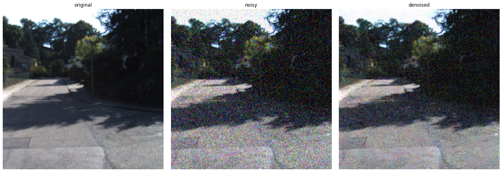
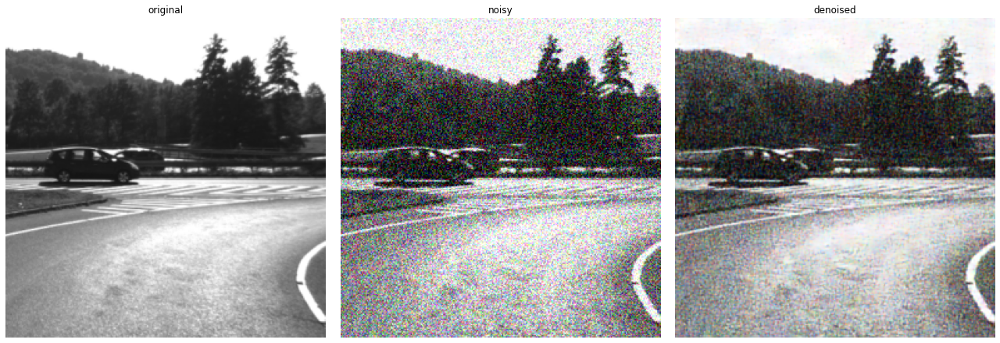
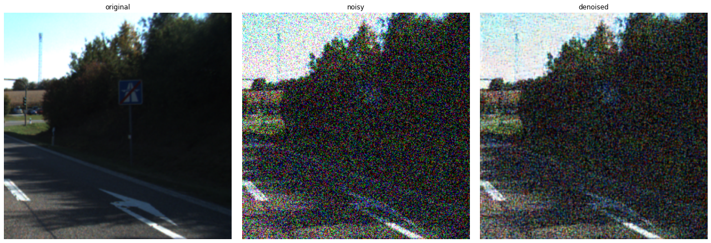

<div align="center">

**A library for blind image denoising algorithms using bias free denoising CNN's**
___

[Getting Started](#Pretrained) •
[License](https://github.com/NikolasMarkou/blind_image_denoising/blob/main/LICENSE)

[]()
[]()

</div>

___

# Blind Image Denoising

The idea is that denoising is a task orthogonal to most medium/high level computer vision tasks and should always be performed beforehand by a fast, independently trained, bias free network. This would enable any medium/high level vision networks to focus on their main task.

## Target
My target is to create a series of:

* multi scale
* interpretable
* high performance
* low memory footprint
* fixed budget (feed forward convolutional neural network)

models that performs denoising on an input (grayscale or colored) image. 

The bias-free nature of the model allows for easy interpretation and use as prior
for hard inverse problems.


## Interpretation 
Interpretation comes naturally by implementing the CVPR 2020 paper : 

["ROBUST AND INTERPRETABLE BLIND IMAGE DENOISING VIA BIAS - FREE CONVOLUTIONAL NEURAL NETWORKS"](https://arxiv.org/abs/1906.05478)

This paper provides excellent results


The bias-free nature of the model means that it is completely interpretable as a weighted mask per pixel for each pixel as shown below.


## Corruption types
In order to train such a model we corrupt an input image using 
several types of noise and then try to recover the original image

* subsampling noise
* normally distributed additive noise (same per channel / different same per channel)
* normally distributed multiplicative noise (same per channel / different same per channel)


## Pretrained models

Currently, we have 3 pretrained models:

* [resnet_color_1x6_bn_16x3x3_256x256_l1_relu](bfcnn/pretrained/resnet_color_1x6_bn_16x3x3_256x256_l1_relu)
* [resnet_color_1x12_bn_16x3x3_256x256_l1_relu](bfcnn/pretrained/resnet_color_1x12_bn_16x3x3_256x256_l1_relu)
* [resnet_color_1x18_bn_16x3x3_256x256_l1_relu](bfcnn/pretrained/resnet_color_1x18_bn_16x3x3_256x256_l1_relu)

They are all `resnet` variants with depths 6, 12 and 18.
They were all trained for 20 epochs on `KITTI`, `Megadepth`, `BDD`, `WIDER` and `WFLW` datasets.


## Image examples

The following samples are `256x256` crops from the `KITTI` dataset, 
denoised using the `resnet_color_1x18_bn_16x3x3_256x256_l1_relu` model.

We add truncated normal noise with different standard deviations and calculate the 
`Mean Absolute Error (MAE)` both for the noisy images, and the denoised images. 
The pixel range is 0-255. 

We can clearly see that the model adapts well to different ranges of noise.

noise (std) | MAE (noisy) | MAE (denoised) | Normal - Noisy - Denoised                     |
---|-----|-----|----------------------------------------------|
1  |0.65|4.33 | |
5  |3.50|3.39 | |
10 |6.44|5.19 | |
20 |13.22|6.60 | |
30 |19.84|8.46 | |
40 |27.02|12.95| |
50 |30.59|15.06| |
60 |34.34|17.81| |
70 |40.64|22.36| |
80 |45.68|27.99| |

## How to use (from scratch)

1. prepare training input
2. prepare training configuration
3. run training
4. export to tflite and saved_model format
5. use models

### Train
Prepare a training configuration and train with the following command:  
```bash
python -m bfcnn.train \ 
  --model-directory ${TRAINING_DIR} \ 
  --pipeline-config ${PIPELINE}
```
### Export
Export to frozen graph and/or tflite with the following command:
```bash
python -m bfcnn.export \
    --checkpoint-directory ${TRAINING_DIR} \
    --pipeline-config ${PIPELINE} \
    --output-directory ${OUTPUT_DIR} \
    --to-tflite
```

## How to use (pretrained)

Use any of the pretrained models included in the package.

* [resnet_color_1x6_bn_16x3x3_256x256_l1_relu](bfcnn/pretrained/resnet_color_1x6_bn_16x3x3_256x256_l1_relu)
* [resnet_color_1x12_bn_16x3x3_256x256_l1_relu](bfcnn/pretrained/resnet_color_1x12_bn_16x3x3_256x256_l1_relu)
* [resnet_color_1x18_bn_16x3x3_256x256_l1_relu](bfcnn/pretrained/resnet_color_1x18_bn_16x3x3_256x256_l1_relu)


```python
import bfcnn
import tensorflow as tf

# load model
denoiser_model = \
    bfcnn.load_model(
        "resnet_color_1x6_bn_16x3x3_256x256_l1_relu")

# create random tensor
input_tensor = \
    tf.random.uniform(
        shape=[1, 256, 256, 3],
        minval=0,
        maxval=255,
        dtype=tf.int32)
input_tensor = \
    tf.cast(
        input_tensor,
        dtype=tf.uint8)

# run inference
denoised_tensor = denoiser_model(input_tensor)
```

## Designing the best possible denoiser
1. Add a small hinge at the MAE loss. 2 (from 255) seems to work very good
2. Multiscale models work better, 3-4 scales is ideal.
3. Soft-Orthogonal regularization provides better generalization, but it's slower to train.
4. Effective Receptive Field regularization provides better generalization, but it's slower to train.
5. Squeeze-and-Excite provides a small boost without many additional parameters.
6. Avoid Batch Normalization at the end.
7. Residual learning (learning the noise) trains faster and gives better metrics 
   but may give out artifacts, so better avoid it.
8. Every sample in each batch uses independent forms of noise.
9. Selectors block boosts conversion speed and accuracy

All these options are supported in the configuration.

## Model types
We have used traditional (bias free) architectures.
* resnet
* resnet with sparse constraint
* resnet with on/off per resnet block gates
* all the above models with multi-scale processing

## Multi-Scale
The system is trained in multiple scales by implementing ideas 
from LapSRN (Laplacian Pyramid Super-Resolution Network) and MS-LapSRN (Multi-Scale Laplacian Pyramid Super-Resolution Network)


## Low-Memory footprint
By using a gaussian pyramid and a shared bias-free CNN model between each scale, 
we can ensure that we have a small enough model to run on very small devices while ensure we
have a big enough ERF (effective receptive field) for the task at hand.


### Additions
#### [Multi-Scale Laplacian Pyramid](bfcnn/pyramid.py)
Our addition (not in the paper) is the laplacian multi-scale pyramid
that expands the effective receptive field without the need to add many more layers (keeping it cheap computationally).


Which breaks down the original image into 3 different scales and processes them independently:


We also have the option to add residuals at the end of each processing levels, so it works like an iterative process:


#### [Multi-Scale Gaussian Pyramid](bfcnn/pyramid.py)
Our addition (not in the paper) is the gaussian multi-scale pyramid
that expands the effective receptive field without the need to add many more layers (keeping it cheap computationally).


#### [Squeeze and Excite with residual](bfcnn/utilities.py)
Every resnet block has the option to include a residual squeeze and excite element (not in the paper) to it.

#### Normalization layer
Our addition (not in the paper) is a (non-channel wise and non-learnable) normalization layer (not BatchNorm) 
after the DepthWise operations. This is to enforce sparsity with the differentiable relu below.

#### Differentiable RELU
Our addition (not in the paper) is a differentiable relu for specific operations.


#### [Soft Orthonormal Regularization](bfcnn/regularizer.py)
Added optional orthogonality regularization constraint as found in paper [Can We Gain More from Orthogonality Regularizations in Training Deep CNNs?](https://arxiv.org/abs/1810.09102).
This forces a soft ortho-normal constraint on the kernels.

#### [Soft Orthogonal Regularization](bfcnn/regularizer.py)
Custom regularization that forces a soft orthogonal constraint on the kernels while still allowing the kernels to grow independently or shrink to almost zero.

#### [Effective Receptive Field Regularization](bfcnn/regularizer.py)
Custom regularization that gives incentive to convolutional kernels to have higher weights away from the center

## References
1. [Robust and interpretable blind image denoising via bias-free convolutional neural networks](https://arxiv.org/abs/1906.05478)
2. [Fast and Accurate Image Super-Resolution with Deep Laplacian Pyramid Networks](https://arxiv.org/abs/1710.01992)
3. [Densely Residual Laplacian Super-Resolution](https://arxiv.org/abs/1906.12021)
4. [Can We Gain More from Orthogonality Regularizations in Training Deep CNNs?](https://arxiv.org/abs/1810.09102)
5. [Squeeze-and-Excitation Networks](https://arxiv.org/abs/1709.01507)

## Installation notes

>`tensorflow_graphics` requires that you install the following packages:
>>`libopenexr-dev`
>>`python3-dev`

## Special Thanks
I would like to thank [Pantelis Georgiades](https://www.linkedin.com/in/pantelisgeor/) and Alexandros Georgiou from the [Cyprus Institute ](https://www.cyi.ac.cy/) for doing precious hyperparameter search for me on their super computer. Their help accelerated my project enormously.
